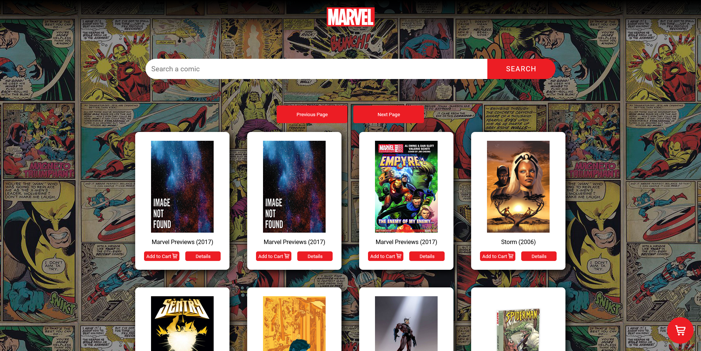
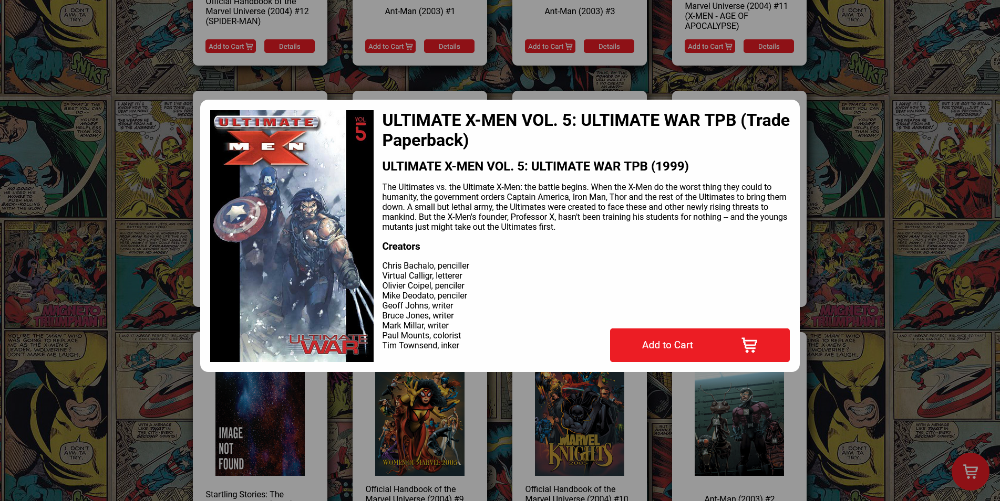
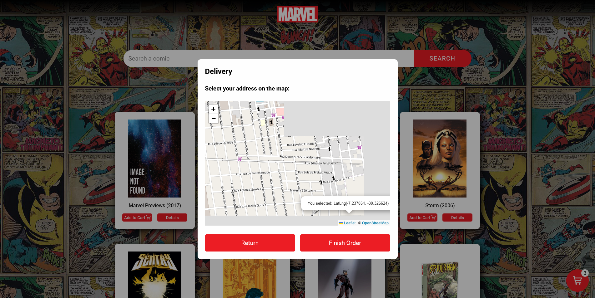

# Single Page aplication - Marvel comics API
Challenge from a selection, to build a single page aplication fetching from the Marvel API.

## Table of contents

- [Overview](#overview)
  - [The project](#the-project)
  - [Screenshots](#screenshots)
  - [Links](#links)
- [My process](#my-process)
  - [Built with](#built-with)
  - [What I learned](#what-i-learned)
  - [Continued development](#continued-development)
- [Author](#author)

## Overview

### The project

Users should be able to:

- Search for comics with the search bar
- View a details modal with more details about the comic
- Simulate a cart, where the user can add the selected comic and it will appear on the cart modal
- Open the cart modal using the cart icon
- Keep up with the amount of itens on the cart from a icon on the cart
- Select the delivery address on a map
- Reset all the states after finishing the order
- See hover states for all interactive elements on the page

### Screenshot
- Main page

- Details Modal

- Cart Modal

- Map section

### Links

- Live Site URL: [here](https://jallanoli.github.io/faq-accordion-card-main/)

## My process

### Built with

- Semantic HTML5 markup
- CSS custom properties
- CSS Animations
- Flexbox
- JavaScript
- Fetch API
- Leaflet API

### What I learned

This challenge brought a lot of experiences and learnings, be it about Javascript in general, DOM manipulation, even some css features and details, like responsive layouts. 

### Continued development

Looking foward to make a refactored code, claner, with better performance. Going even further, would like to pratice my react skills making this project with it.

## Author

- Frontend Mentor - [@jAllanOli](https://www.frontendmentor.io/profile/jAllanOli)
- gitHub - [@jAllanOli](https://github.com/jAllanOli)
